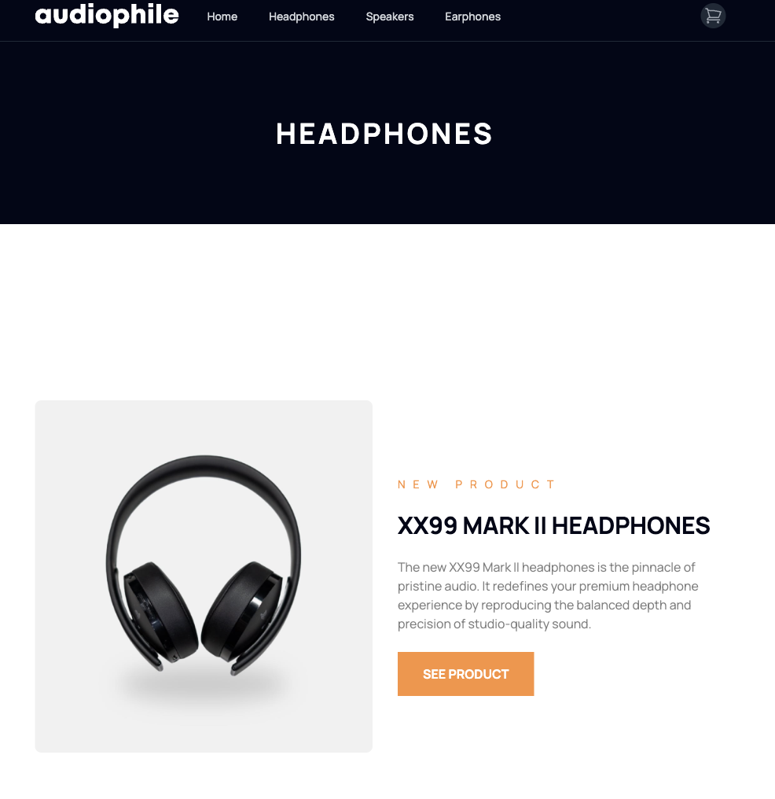

# E-Commerce Front-End Multipage Website

This is a responsive e-commerce front-end multipage website developed from scratch using React and styled with Tailwind CSS. It is based on a design from [Frontend Mentor](https://www.frontendmentor.io/).

## Demo

You can see a live demo of the website at [Audiophile - Gabriel Ferrales](https://audiophile-gf.netlify.app/).

## Features

- Responsive design: The website is optimized for various screen sizes and devices.
- Multipage layout: It includes multiple pages such as the homepage, product pages, and a shopping cart component.
- Cart functionality: Users can add products to their shopping cart and view the cart contents, the data persists with local storage.
- Custom styling: Tailwind CSS was used to create a visually appealing and consistent design.
- React components: The project is organized into reusable React components for easy maintenance and scalability.

